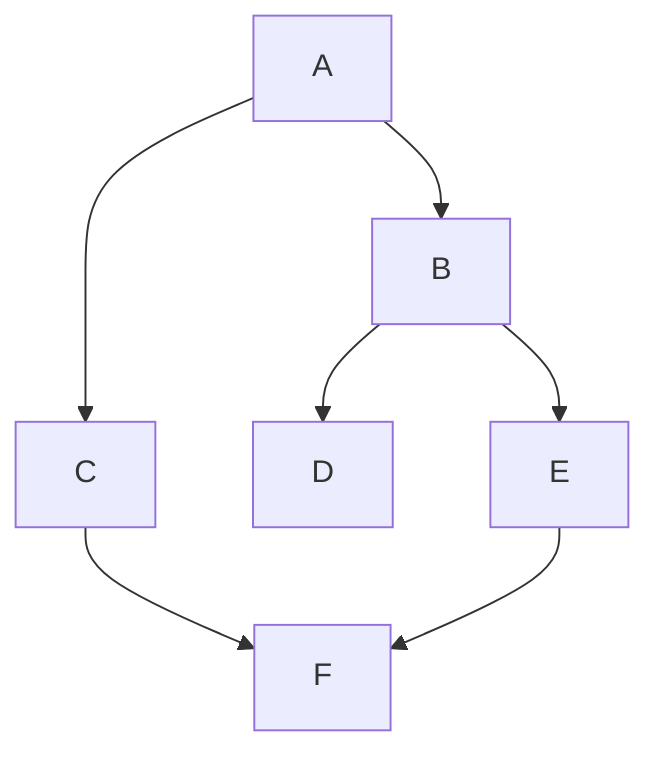

# INTROAI — AI Agent and Graph Traversal

A beginner-friendly Python project containing a rule-based AI agent and graph traversal implementations for DFS and BFS.

## Features
- Rule-based chatbot
- Safe mathematical expression solver
- DFS graph traversal
- BFS graph traversal
- Best, average, and worst-case complexity analysis
- Py-Spy profiling instructions
- GitHub contribution tracking

## Project Structure

    INTROAI/
    ├── main.py
    ├── dfs_bfs.py
    ├── README.md
    ├── ContributionLog.md
    ├── PySpy.md
    ├── requirements.txt
    ├── .gitignore
    └── LICENSE

## DFS and BFS Graph

## Traversal Output

    DFS Traversal:
    A B D E F C

    BFS Traversal:
    A B C D E F

## Complexity Analysis

For an adjacency-list graph, both DFS and BFS visit vertices and edges at most once.

| Algorithm | Best Case | Average Case | Worst Case |
|---|---|---|---|
| DFS | O(V + E) | O(V + E) | O(V + E) |
| BFS | O(V + E) | O(V + E) | O(V + E) |

Where:
- `V` = number of vertices
- `E` = number of edges

## Py-Spy

See [PySpy.md](PySpy.md) for profiling commands.

## How to Run

    python main.py
    python dfs_bfs.py

## Technologies Used
- Python 3
- Regular expressions
- Operator module
- Collections deque
- Git and GitHub
- Py-Spy

## Project Objective

The project demonstrates basic AI-agent programming along with fundamental graph traversal algorithms and performance profiling.

## Author

**Anushka**

GitHub: `anushka28777-a11y`

## License

This project is intended for educational and learning purposes.